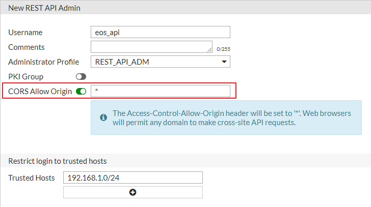

# 개요
Fortinet 제품 중 FortiGate에서 제공되는 REST API를 사용하여 CRUD 및 추후에 사용될 Management Console 제작 위한 기능 구현

## 테스트 환경
FortiGate(192.168.1.99) -------------  UTP  ------------ Server(192.168.1.100)   
- Server에서 설계되어있는 REST API URL로 Request(fetch() 사용)  
- Response 데이터를 JSON 형식으로 변환
- 교차 출처 요청이므로 FortiGate REST API 계정 생성 시 CORS Allow Origin 설정 Enable(하단 이미지 참고)

## 기능
- FortiGate 모든 User 정보 확인
- FortiGate 모든 IPv4 Policy 정보 확인
- FortiGate User 생성
- FortiGate 실시간 Config 다운로드

## 특이사항
1. CORS
- https://developer.mozilla.org/ko/docs/Web/HTTP/CORS
2. WAI-ARIA role 
3. FortiGate REST API Document는 Public이 아님